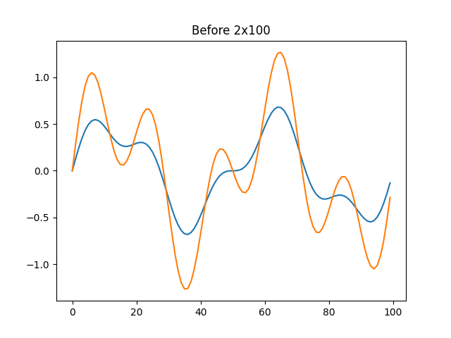
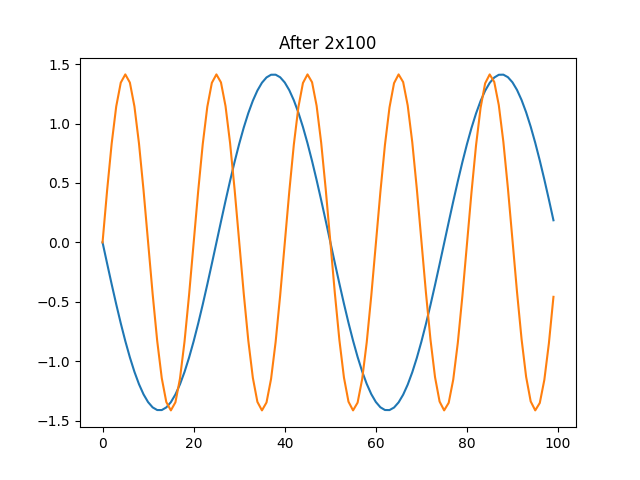

# Analysis of time series in the spectrum of independent components

The program aims to demonstrate the use of the FastICA algorithm on EEG data is to perform blind source separation of cortical brain activity.

## Used libraries

* [scikit-learn](https://scikit-learn.org/stable/index.html)
* [matplot-lib](https://matplotlib.org/)

## Use cases for FastEEG.py
``python main.py [-h] -i INPUT -of OUT_FILE_PATH [-oc OUT_CHART_PATH] [--header HEADER] -n N -m M [-f {logcosh,exp,cube}] [-c CHART]``

* `-h, --help` Shows help for script  


* ```-i INPUT, --input INPUT  ``` Path to input file  


* ```-of OUT_FILE_PATH, --out-file-path OUT_FILE_PATH``` Output file path. If exist will be overwritten.


* ```-oc OUT_CHART_PATH, --out-chart-path OUT_CHART_PATH``` Output directory path for charts


* ```--header HEADER``` Bool flag if file has headers.


* `-n N`  Number of columns in input file.


* `-m M` Number of rows in input file. (Not counting the header if it exists)  


* `-f {logcosh,exp,cube}, --fun {logcosh,exp,cube} ` 
                       The functional form of the G function used in the approximation to neg-entropy

* `-c CHART, --chart CHART`
                        Bool flag that decides to save chart to out char path specified  in `-oc` (`--out-chart-path`)

## Use cases for FastEEG_mff.py
`fastEEG_mff.py [-h] -i INPUT -of OUT_FILE_PATH`  
`[-oc OUT_CHART_PATH]`  
`[--header HEADER]`  
`-n N -m M `  
`[-f {logcosh,exp,cube}]`  
`[-c CHART] `  
`[-b [BEGIN_TIME]]`  
`[-e [END_TIME]]`   
`[-s [SFREQ]] `  
`[-fmin [FREQUENCY_MIN]]`  
`[-fmax [FREQUENCY_MAX]] `  
`[-v [VERBOSE]] `  
`[-ce [CHART_EXTENSION]]`  

Program for performing FastICA algorithm on dataframe.

optional arguments:
 * `-h, --help`            show this help message and exit
 * `-i INPUT, --input INPUT`
                      input file path  


 * `-of OUT_FILE_PATH, --out-file-path OUT_FILE_PATH`
                      output file path. If exist will be overwritten.


 * `-oc OUT_CHART_PATH, --out-chart-path OUT_CHART_PATH`
                      output directory path for charts


 * `--header HEADER `      Bool flag if file has headers.


 * `-n N`                  number of columns


 * `-m M`                  number of rows


 * `-f {logcosh,exp,cube}, --fun {logcosh,exp,cube}`
                      The functional form of the G function used in the approximation to neg-entropy


 * `-c CHART, --chart CHART`
                      Bool flag to decide whether to save the graphical chart


 * `-b [BEGIN_TIME], --begin-time [BEGIN_TIME]`
                      Start time of the raw data to use in seconds (must be >= 0).


 * `-e [END_TIME], --end-time [END_TIME]`
                      End time of the raw data to use in seconds (cannot exceed data duration).


 * `-s [SFREQ], --sfreq [SFREQ]`
                      New sample rate to use.
 *` -fmin [FREQUENCY_MIN], --frequency-min [FREQUENCY_MIN]`
                      Minimum value of filtering frequency


 * `-fmax [FREQUENCY_MAX], --frequency-max [FREQUENCY_MAX]`
                      Max value of filtering frequency


 * `-v [VERBOSE], --verbose [VERBOSE]`
                      Control verbosity of the logging output. If None, use the default verbosity level.

 * `-ce [CHART_EXTENSION], --chart-extension [CHART_EXTENSION]`
                      Chart extension


### Example

`python fastEEG.py -i resources/data2x100.csv  -oc resources/ -n 2 -m 100 -f logcosh -c True -of resources/data2x100_out.csv`

`python fastEEG_mff.py -i resources/1111.mff -m 100 -n 2 -oc fastEEGMff/ -f cube -c True -of fastEEGMff/data_mne_out.csv`


####Before the execution of the algorithm.  
Signal mixture - distribution of values 
  
####After executing the algorithm
We obtain separated sources.

